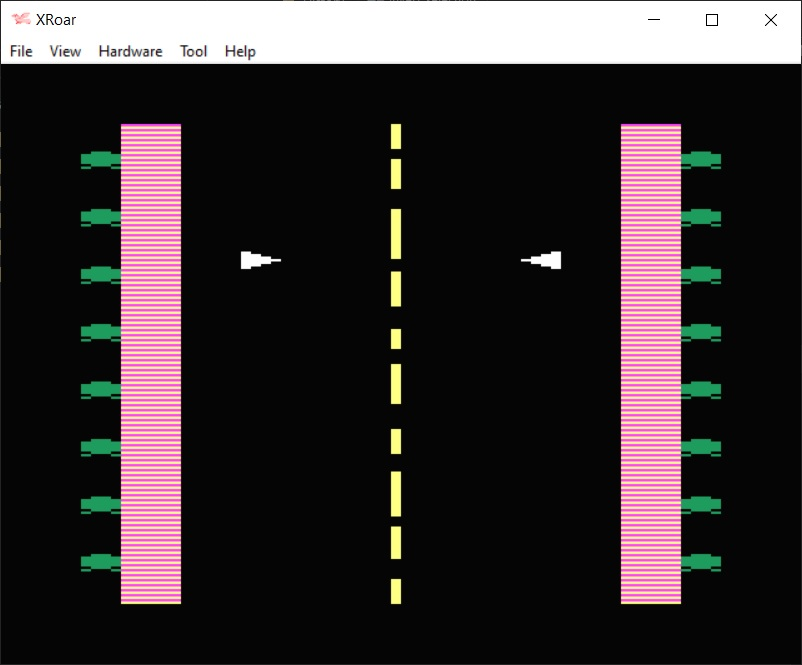

This is a 6809 assembly language two player arcade game for the Dragon 32.  The object of the game is to destroy your opponents droids.  Joysticks are required.

The program was originally published in the Dragon 32 Micropaedia insert of Personal COmputer News editions 27,28 and 29 (8th / 15th / 22nd September 1983).

| File | Description |
| --- | --- |
| build.bat |  A windows batch file to assemble and run the program file.  1.  Set the path to asm6809 and XROAR (change as required)    2.  Assemble the code file using asm6809   3.  Run the resulting DroidWar.bin file in XROAR |
| DroidWar.asm | The assembly code file |
| DroidWar_Loader.bas | The original BASIC program to load the machine code into memory. |
| DroidWar.cas | The assembled game file. |

Please note, asm6809 and XROAR(and associated ROMS) are not included, but can be downloaded from the following locations: 
https://www.6809.org.uk/xroar/   https://www.6809.org.uk/asm6809/

To run the game without assembling the code file:
+ Download DroidWar.cas to your device
+ Open a browser and paste the following URL:  https://www.6809.org.uk/xroar/online/
+ Under the emulation screen, click the File tab
+ Click the load button, and select the downloaded DroidWar.cas
+ In the emulation screen, type the following: CLOADM:EXEC   <press enter>
                
In order for this game to run on the TRS-80 Color Computer, the following ROM sub-routines will need to be amended....

| Dragon 32 | TRS-80 | Description |
| --- | --- | --- |
| $BBE5 (48101) | $A1C1 (41409) | POLCAT: scans keyboard and puts the character in A Register  |
| $90E5 (37093) | $B99C (47516) | Outputs a text string to device number in DEVN (defaults to screen) | 
| $BA77 (47735) | $A928 (43304) | CLEAR SCREEN: clears screen to space and 'homes' cursor |
| $BD52 (48466) | $A9DE (43486) | Reads all joysticks |

        
